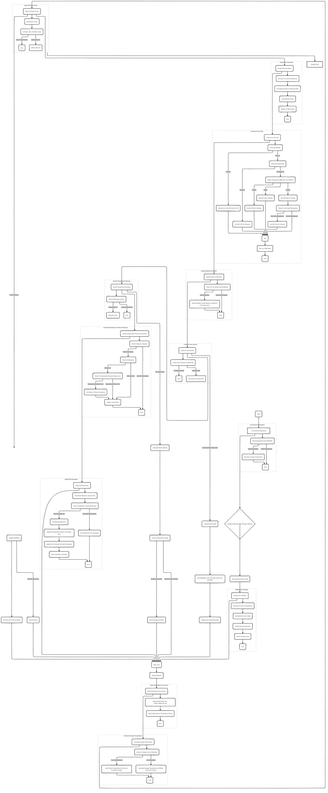

# Soldering Iron Controller

## Table of Contents
1. [Introduction](#introduction)
2. [Features](#features)
3. [Hardware Requirements](#hardware-requirements)
4. [Software Dependencies](#software-dependencies)
5. [Installation](#installation)
6. [Wiring Guide](#wiring-guide)
7. [Usage](#usage)
8. [Temperature Control System](#temperature-control-system)
9. [Display Options](#display-options)
10. [Safety Features](#safety-features)
11. [Persistent Settings](#persistent-settings)
12. [Troubleshooting](#troubleshooting)
13. [Maintenance](#maintenance)
14. [Simulation](#simulation)
15. [Adaptive PID Control](#adaptive-pid-control)
16. [Flowchart](#flowchart)
17. [Contributing](#contributing)

## Introduction

The **Soldering Iron Controller** is an Arduino-based system designed to precisely manage soldering iron temperatures. It supports PID-based control, a user-friendly rotary encoder, and a vibrant LED status indicator, making it an ideal tool for hobbyists and professionals.

## Features

- Precise temperature control (100°C to 500°C range)
- PID-based temperature regulation with adaptive tuning
- Temperature ramping for rapid heating
- OLED or I2C LCD display for clear temperature readouts
- WS2812 RGB LED for status indication
- Rotary encoder with push button for intuitive control
- Automatic shut-off after 10 minutes of inactivity
- Watchdog timer for system reliability
- Temperature sensor for accurate readings
- PWM control for soldering iron heating element
- Persistent settings saved in EEPROM

## Hardware Requirements

- Arduino (e.g., Arduino Uno, Nano)
- OLED Display (SSD1306) or 16x2 I2C LCD Display
- WS2812 RGB LED
- Rotary Encoder with push button
- Analog temperature sensor
- MOSFET (for iron control)
- Soldering iron
- Power supply
- Buzzer
- Resistors, capacitors (refer to wiring guide)

## Software Dependencies

Ensure the following libraries are installed:

- **Wire.h** (built-in)
- **Adafruit_GFX.h** (for OLED)
- **Adafruit_SSD1306.h** (for OLED)
- **LiquidCrystal_I2C.h** (for LCD)
- **BigNumbers_I2C.h** (for large font on LCD)
- **Adafruit_NeoPixel.h** (for WS2812 LED)
- **EEPROM.h** (built-in)
- **PID_v1.h** (for PID control)

## Installation

1. Clone or download this repository.
2. Open the `.ino` file in the Arduino IDE.
3. Install required libraries via Library Manager.
4. Adjust pin assignments in the code to match your wiring.
5. Choose between OLED and LCD display by toggling the `USE_OLED` define in the code.
6. Upload the code to your Arduino board.

## Wiring Guide

Follow the wiring instructions for correct setup:

1. **Temperature Sensing**:
   - Connect the sensor to Arduino pin A0.

2. **Iron Control**:
   - Connect the MOSFET gate to pin D10.

3. **Display**:
   - OLED: Connect SDA to A4, SCL to A5.
   - LCD: Same connections (SDA to A4, SCL to A5).

4. **WS2812 LED**:
   - Data pin connects to D12.

5. **Rotary Encoder**:
   - CLK to D3, DT to D4, switch to D5.

6. **Buzzer**:
   - Connect to D2.

7. **LED Off Indicator**:
   - Connect to D8.

Ensure all components share a common ground and proper power connections.

## Usage

1. Power on the controller; the last used temperature will be loaded.
2. Adjust the temperature with the rotary encoder.
3. Status LEDs indicate:
   - **Red**: Heating
   - **Green**: Ready
   - **Blue**: Cooling
   - **Yellow**: Warning (near max temperature)
   - **Purple**: Ramping
   - **Off**: Iron off or auto-shutoff
4. Press the encoder button to toggle the iron on/off or start ramping mode.

## Temperature Control System

### PID Control
The controller uses a PID algorithm to maintain stable temperatures:
- **Kp**: 2
- **Ki**: 5
- **Kd**: 1

Adjust these values in the code for custom tuning.

### Temperature Ramping
- Activated by pressing the encoder button.
- Ramps to the max temperature (500°C) over 20 seconds, displaying a countdown.
- Returns to the previous setpoint after ramping.

## Display Options

Choose between two display types:
1. **OLED Display (SSD1306)**
2. **16x2 I2C LCD**

Switch displays by commenting/uncommenting the `USE_OLED` define in the code.

## Safety Features

- **Automatic Shut-off**: After 10 minutes of inactivity, the iron is turned off.
- **Watchdog Timer**: Resets the system if unresponsive.
- **Overheat Protection**: Stops heating if the temperature exceeds a safe threshold.
- **Error Detection**: Monitors sensor and system issues.

## Persistent Settings

The system saves the last temperature setting in EEPROM, allowing it to persist across power cycles.

## Troubleshooting

- **Inaccurate Temperature Readings**: Check sensor wiring.
- **Iron Not Heating**: Check MOSFET and power supply.
- **LED Not Working**: Ensure WS2812 wiring and library installation.
- **System Freezing**: Verify connections and PID stability.
- **PID Tuning Issues**: Adjust Kp, Ki, Kd as needed.

## Maintenance

- Inspect connections regularly.
- Clean the temperature sensor periodically.
- Update firmware as new versions become available.
- Recalibrate the sensor if readings become inaccurate.

## Simulation

Test the setup in [Wokwi](https://wokwi.com/projects/408754608532252673).

## Adaptive PID Control

The controller can adapt PID values based on system behavior:
- **Loop Monitoring**: The system adapts PID values every 225 loops.
- **Error Handling**: Sum of errors and counts are logged for adaptation.
- **Overshoot Protection**: Limits the temperature overshoot to 10°C.

## Flowchart

## Contributing

Contributions are welcome! Fork this repository, make your changes, and submit a pull request.
