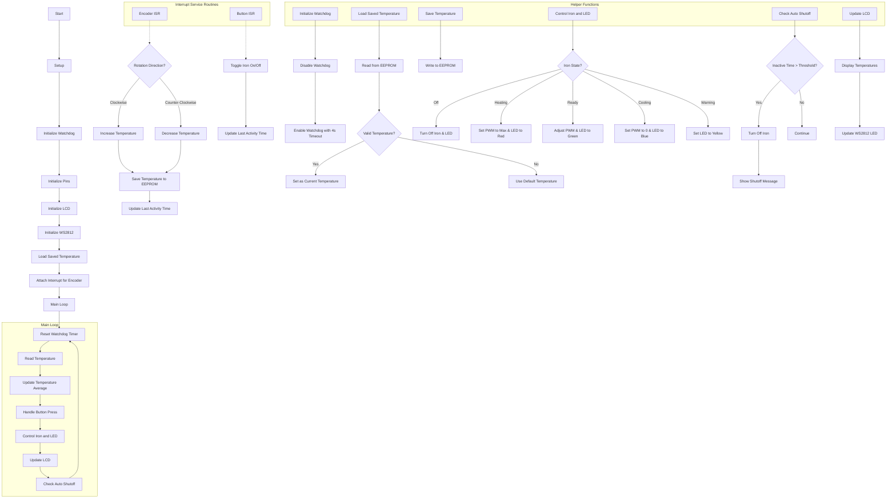

```mermaid
graph TD
    A[Start] --> B[Setup]
    B --> C[Initialize Watchdog]
    C --> D[Initialize Pins]
    D --> E[Initialize LCD]
    E --> F[Initialize WS2812]
    F --> G[Load Saved Temperature]
    G --> H[Attach Interrupt for Encoder]
    H --> I[Main Loop]

    I --> J[Reset Watchdog Timer]
    J --> K[Read Temperature]
    K --> L[Update Temperature Average]
    L --> M[Handle Button Press]
    M --> N[Control Iron and LED]
    N --> O[Update LCD]
    O --> P[Check Auto Shutoff]
    P --> J

    Q[Encoder ISR] -.-> R{Rotation Direction?}
    R -->|Clockwise| S[Increase Temperature]
    R -->|Counter-Clockwise| T[Decrease Temperature]
    S & T --> U[Save Temperature to EEPROM]
    U --> V[Update Last Activity Time]

    W[Button ISR] -.-> X[Toggle Iron On/Off]
    X --> Y[Update Last Activity Time]

    Z[Initialize Watchdog] --> AA[Disable Watchdog]
    AA --> AB[Enable Watchdog with 4s Timeout]

    AC[Load Saved Temperature] --> AD[Read from EEPROM]
    AD --> AE{Valid Temperature?}
    AE -->|Yes| AF[Set as Current Temperature]
    AE -->|No| AG[Use Default Temperature]

    AH[Save Temperature] --> AI[Write to EEPROM]

    AJ[Control Iron and LED] --> AK{Iron State?}
    AK -->|Off| AL[Turn Off Iron & LED]
    AK -->|Heating| AM[Set PWM to Max & LED to Red]
    AK -->|Ready| AN[Adjust PWM & LED to Green]
    AK -->|Cooling| AO[Set PWM to 0 & LED to Blue]
    AK -->|Warning| AP[Set LED to Yellow]

    AQ[Check Auto Shutoff] --> AR{Inactive Time > Threshold?}
    AR -->|Yes| AS[Turn Off Iron]
    AS --> AT[Show Shutoff Message]
    AR -->|No| AU[Continue]

    AV[Update LCD] --> AW[Display Temperatures]
    AW --> AX[Update WS2812 LED]

    subgraph Main Loop
    J
    K
    L
    M
    N
    O
    P
    end

    subgraph Interrupt Service Routines
    Q
    W
    end

    subgraph Helper Functions
    Z
    AC
    AH
    AJ
    AQ
    AV
    end
```
