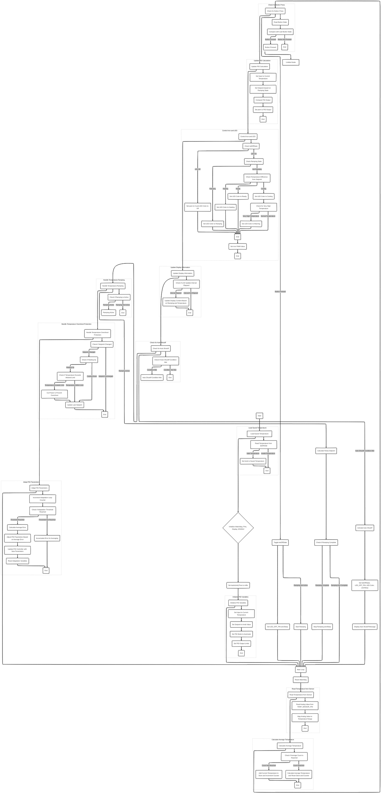

```mermaid

---
config:
  theme: neo
  layout: elk
  look: handDrawn
---
flowchart TD
 subgraph subGraph0["Load Saved Temperature"]
        B1("Read Temperature from EEPROM")
        B["Load Saved Temperature"]
        B2("Set knob to Saved Temperature")
        B3("End")
  end
 subgraph subGraph1["Initialize PID Variables"]
        E1("Set Input to Current Temperature")
        E("Initialize PID Variables")
        E2("Set Setpoint to knob Value")
        E3("Set PID Mode to Automatic")
        E4("Set PID Output Limits")
        E5("End")
  end
 subgraph subGraph2["Read Temperature from Sensor"]
        H1("Read Analog Value from TEMP_SENSOR_PIN")
        H("Read Temperature from Sensor")
        H2("Map Analog Value to Temperature Range")
        H3("End")
  end
 subgraph subGraph3["Calculate Average Temperature"]
        I1("Check if Average Count is Reached")
        I("Calculate Average Temperature")
        I2("Add Current Temperature to Store and Increment Counter")
        I3("End")
        I4("Calculate Average Temperature and Reset Store and Counter")
  end
 subgraph subGraph4["Check for Button Press"]
        J1("Read Button State")
        J("Check for Button Press")
        J2("Compare with Last Button State")
        J3("Button Pressed")
        J4("End")
  end
 subgraph subGraph5["Update PID Calculation"]
        K1("Set Input to Current Temperature")
        K("Update PID Calculation")
        K2("Set Setpoint based on Ramping State")
        K3("Compute PID Output")
        K4("Set pwm to PID Output")
        K5("End")
  end
 subgraph subGraph6["Control Iron and LED"]
        L1("Check ledOffState")
        L("Control Iron and LED")
        L2("Set pwm to 0 and LED Color to Off")
        L8("End")
        L3("Check Ramping State")
        L4("Set LED Color to Ramping")
        L5("Check Temperature Difference from Setpoint")
        L6("Set LED Color to Heating")
        L7("Set LED Color to Ready")
        L9("Set LED Color to Cooling")
        L10("Check for Very High Temperature")
        L11("Set LED Color to Warning")
        L12("Set Iron PWM Value")
        L13("End")
  end
 subgraph subGraph7["Update Display Information"]
        M1("Check if LCD Update Interval Elapsed")
        M("Update Display Information")
        M2("Update Display Content Based on Ramping and Temperature")
        M3("End")
  end
 subgraph subGraph8["Check for Auto Shutoff"]
        N1("Check if Auto Shutoff Condition Met")
        N("Check for Auto Shutoff")
        N2("Auto Shutoff Condition Met")
        N3("End")
  end
 subgraph subGraph9["Handle Temperature Ramping"]
        O1("Check if Ramping is Active")
        O("Handle Temperature Ramping")
        O2("Ramping Active")
        O3("End")
  end
 subgraph subGraph10["Handle Temperature Overshoot Protection"]
        P1("Check if Setpoint Changed")
        P("Handle Temperature Overshoot Protection")
        P2("Check if Heating Up")
        P3("Check if Temperature Exceeds Allowed Limit")
        P4("Cut Power to Prevent Overshoot")
        P5("Update Last Setpoint")
        P6("End")
  end
 subgraph subGraph11["Adapt PID Parameters"]
        Q1("Increment Adaptation Loop Counter")
        Q("Adapt PID Parameters")
        Q2("Check if Adaptation Threshold Reached")
        Q3("Calculate Average Error")
        Q4("Adjust PID Parameters Based on Average Error")
        Q5("Update PID Controller with New Parameters")
        Q6("Reset Adaptation Variables")
        Q7("End")
        Q8("Accumulate Error for Averaging")
  end
    A("Start") --> B
    B --> C{"Initialize Watchdog, Pins, Display, WS2812"} & B1
    C --> D("Set lastActivityTime to millis")
    D --> E
    E --> F("Main Loop") & E1
    F --> G("Reset Watchdog")
    G --> H
    H --> I & H1
    I --> J & I1
    J --> K & J1
    K --> L & K1
    L --> M & L1
    M --> N & M1
    N --> O & N1
    O --> P & O1
    P --> Q & P1
    Q --> F & Q1
    J -- Button Pressed --> R("Toggle ledOffState")
    R --> S("Set LED_OFF_PIN and Beep")
    R -- Ramping Not Active --> T("Start Ramping")
    S --> F
    T --> F
    O -- Ramping Active --> U("Calculate Ramp Setpoint")
    U --> V("Check if Ramping Complete")
    V -- Ramping Complete --> W("Stop Ramping and Beep")
    W --> F
    V -- Ramping Not Complete --> F
    N -- Auto Shutoff Condition Met --> X("Activate Auto Shutoff")
    X --> Y("Set ledOffState, LED_OFF_PIN, LED Color, and Beep")
    Y --> Z("Display Auto Shutoff Message")
    Z --> F
    B1 -- Valid Temperature --> B2
    B2 --> B3
    B1 -- Invalid Temperature --> B3
    E1 --> E2
    E2 --> E3
    E3 --> E4
    E4 --> E5
    H1 --> H2
    H2 --> H3
    I1 -- Count Not Reached --> I2
    I2 --> I3
    I1 -- Count Reached --> I4
    I4 --> I3
    J1 --> J2
    J2 -- Button Pressed --> J3
    J2 -- Button Not Pressed --> J4
    K1 --> K2
    K2 --> K3
    K3 --> K4
    K4 --> K5
    L1 -- LED Off --> L2
    L2 --> L8
    L1 -- LED On --> L3
    L3 -- Ramping --> L4
    L4 --> L8
    L3 -- Not Ramping --> L5
    L5 -- Heating --> L6
    L6 --> L8
    L5 -- Ready --> L7
    L7 --> L8
    L5 -- Cooling --> L9
    L9 --> L10
    L10 -- Very High Temperature --> L11
    L11 --> L8
    L10 -- Normal Temperature --> L8
    L8 --> L12
    L12 --> L13
    M1 -- Interval Elapsed --> M2
    M2 --> M3
    M1 -- Interval Not Elapsed --> M3
    N1 -- Condition Met --> N2
    N1 -- Condition Not Met --> N3
    O1 -- Ramping Active --> O2
    O1 -- Ramping Not Active --> O3
    P1 -- Setpoint Changed --> P2
    P2 -- Heating Up --> P3
    P3 -- Temperature Exceeds Limit --> P4
    P4 --> P5
    P5 --> P6
    P3 -- Temperature Within Limit --> P5
    P2 -- Cooling Down --> P5
    P1 -- Setpoint Unchanged --> P6
    Q1 --> Q2
    Q2 -- Threshold Reached --> Q3
    Q3 --> Q4
    Q4 --> Q5
    Q5 --> Q6
    Q6 --> Q7
    Q2 -- Threshold Not Reached --> Q8
    Q8 --> Q7
    subGraph4 --> n1["Untitled Node"]
```
